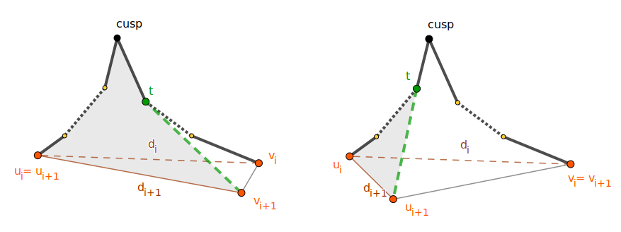

# 简单多边形的生成与内部最短路

## 1. 问题描述

在计算几何中，求一个几何区域内的最优路径是一个基础问题，在机器人路径规划、地理信息系统 (GIS)、电路布线等领域上有广泛应用。另一方面，为了测试各类计算几何算法的正确性、鲁棒性和实际运行效率，需要生成大规模的满足一定约束的几何体，例如生成一个随机的简单多边形。因此，本文将针对以下两个问题分别进行研究：

1. 简单多边形生成(或平面点集的简单多边形化)：给定平面内一组点，构造一个简单多边形，使得多边形的顶点恰好就是点集中的点。
2. 简单多边形内部最短路：给定一个简单多边形，和多边形内部的两个点 $s$ 和 $t$，求 $s$ 到 $t$ 的最短路，要求路径也在多边形内。

## 2. 算法说明

### 2.1 简单多边形生成

### 2.2 简单多边形三角剖分

为了解决简单多边形内部最短路问题，目前的绝大多数算法都需要先将多边形进行三角剖分。我们实现了 $O(n \log n)$ 的基于单调多边形分解的三角剖分算法。该算法的基本原理是先用平面扫描算法，用 $O(n \log n)$ 的时间将简单多边形分解为若干个单调多边形。然后可用 $O(n)$ 的时间对每个单调多边形进行三角剖分。

#### 单调多边形分解

如果一个简单多边形没有内部尖顶 (interior cusp)，它就是单调多边形，内部尖顶又可分为 stalactite 和 stalagmite 两类，分别如下所示：

```
| .... \     / .... |    | ................. |
| ..... \   / ..... |    | ....... m ....... |
| ....... t ....... |    | ..... /   \ ..... |
| ................. |    | .... /     \ .... |
      stalactite               stalagmite
```

本算法通过在每个内部尖顶处引入对角线，来消除内部尖顶，从而将简单多边形分解为若干个单调多边形。为了保证对角线之间不会相交，新引入的对角线有个限制：如果我们从多边形每个顶点触发向左右发射水平线，直到碰到多边形的边，从而将原多边形分为若干个梯形，则对角线必须在一个梯形的内部，且一个梯形内最多只能有一条对角线。

因此算法首先要对简单多边形进行梯形剖分，可用以下基于平面扫描的算法在 $O(n \log n)$ 的时间内完成：首先对所有顶点按纵坐标从大到小排序，简单起见，先假设没有两个顶点有相同的纵坐标(在下文会专门讨论此类情况)。然后依次枚举每个顶点，以当前顶点纵坐标作为当前扫描线的纵坐标，并维护当前扫描线穿过的所有梯形，作为扫描线状态。我们不需要关心梯形的上下边，它们一定与某时刻的扫描线重合，所以只需记录梯形的左右边。同时我们需要让这些梯形保持有序，可将当前扫描线与梯形左侧边交点的横坐标作为排序的依据。然后需要根据当前顶点的与相邻顶点的位置关系，往扫描线状态中插入、删除梯形，或查找扫描线上某个点所在的梯形，因此可用平衡二叉树维护这些梯形，每次以 $O(\log n)$ 的时间完成操作。

在进行梯形剖分的同时，我们还需要引入对角线来消除 stalactite 和 stalagmite。当遇到一个 stalagmite 时，其一定会在某个梯形的底边上，而相应的，该梯形的顶边上也必定有一个多边形的顶点，我们只需将它们相连即可。因此，我们还需要对每个梯形记录其顶边上的属于原多边形的顶点，称其为一个 "helper"。但是此方法只能消除所有 stalagmite，而不能消除所有 stalactite，因为 stalactite 相当于反过来的 stalagmite，有些时候可能需要作为梯形顶边的点，向下找梯形底边上的非 stalagmite 点连边。对于这种情况，我们只需在处理多边形顶点时，对当前梯形判断其 helper 是否是一个 stalactite，且还未被连过边，如果是就将其和当前顶点连边。

最后，对于添加对角线操作，可使用 DCEL 结构，但为了维护边的顺序，需要为每个 helper 同时记录它在 DCEL 结构中的上一条边是什么。这样就可以用 O(1) 的时间维护了。

以下列举了正在处理多边形顶点为 p，其上一条、下一条边分别为 e1，e2 时，所有可能遇到的情况：

1. 起始点：插入一个新的梯形，将 helper 设为 p。

    ```
        p
      / . \
     / ... \
    / e2 e1 \
    ```

2. 结束点：删除梯形。

    ```
    \ e1 e2 /
     \ ... /
      \ . /
        p
    ```

3. 左相邻：查找 p 所在的梯形，修改其左侧边，并将 p 设为 helper。

    ```
      / e1 . |
     / ..... |
    p ...... |
     \ ..... |
      \ e2 . |
    ```

4. 右相邻：查找 p 所在的梯形，修改其右侧边，并将 p 设为 helper。

    ```
    | . e2 \
    | ..... \
    | ...... p
    | ..... /
    | . e1 /
    ```

5. Stalagmite：查找 p 所在的梯形，将其分裂为左右两个新梯形，它们的 helper 都是 p。

    ```
    | ................. |
    | ....... p ....... |
    | ..... /   \ ..... |
    | . e1 /     \ e2 . |
    ```

6. Stalactite：查找 p 所在的左右两个梯形，将它们合并为一个大梯形，将其 helper 设为 p。

    ```
    | . e2 \     / e1 . |
    | ..... \   / ..... |
    | ....... p ....... |
    | ................. |
    ```

#### 单调多边形三角剖分

在上一步添加完对角线后，可通过遍历 DCEL 来得到分出的所有单调多边形。然后也需要对单调多边形顶点按纵坐标从大到小排序，但由于两条单调链已经有序，可以用 O(n) 的时间合并。

然后，按顺序依次处理每个顶点，同时用一个栈维护属于同一单调链的内凸链。每加入一个顶点，分为以下几种情况：

1. 与栈上的点同属一条单调链，则弹出栈上所有当前点可见的点，同时可直接向它们连对角线，最后将当前点加入栈。
2. 与栈上的点位于不同的单调链，则当前可见栈上所有点，需要从栈上弹出除了栈顶外的所有点，同时也直接向它们连对角线，最后将当前点加入栈。

由于每个顶点最多入栈、出栈一次，所以时间复杂度为 O(n)。

#### 处理水平边

在考虑以上算法时，我们都假设没有两个顶点的纵坐标相同。但在实际实现时这种情况不容忽视，需要进行特殊处理。

首先，如果两个纵坐标相同的顶点不是多边形的相邻顶点，即没有水平边，则只需在排序时将纵坐标相同的顶点再按横坐标从小到大排，以上算法仍然适用。

对于梯形剖分时遇到的水平边，我们可以将对顶点 p 的处理推广到对水平边 pq 的处理，也分为以下 6 种情况：

1. 起始：p 和 q 均可作为 helper。

    ```
      q -- p
     / .... \
    / e2  e1 \
    ```

2. 结束： 如果当前梯形有一个 helper 是 stalactile，p 和 q 均可向其连边。

    ```
    \ e1  e2 /
     \ .... /
      p -- q
    ```

3. 左相邻：我们需要选择 p 和 q 中更靠右的作为 helper，以防 helper 向右侧连对角线时与边 pq 重合。

    ```
           Case A              Case B
      / e1 ...... |           / e1 . |
     / .......... |          / ..... |
    p -- q ...... |    q -- p ...... |
          \ ..... |     \ .......... |
           \ e2 . |      \ e2 ...... |
                      (need to add diagonal)
    ```

4. 右相邻：选 p 作为 helper 即可，因为之后与 p 和 q 同一纵坐标的点不会选 p 连对角线。

    ```
      Case C              Case D
    | . e2 \           | ...... e2 \
    | ..... \          | .......... \
    | ...... q -- p    | ...... p -- q
    | .......... /     | ..... /
    | ...... e1 /      | . e1 /
                       (need to add diagonal)
    ```

5. Stalagmite：分裂出的左梯形选 p 作为 helper，右梯形选 q 作为 helper。

    ```
    | .................... |
    | ...... p -- q ...... |
    | ..... /      \ ..... |
    | . e1 /        \ e2 . |
    ```

6. Stalactite：根据 helper 靠右原则，选 p 作为 helper。

    ```
    | . e2 \        / e1 . |
    | ..... \      / ..... |
    | ...... q -- p ...... |
    | .................... |
    ```

这样就能处理有水平边的单调多边形分解了。

不过这样得到的单调多边形也可能有水平边，以上的单调多边形三角剖分算法有时会遇到麻烦。我们考虑以下四种可能的情况：

```
       Case A              Case B
  / e1 ...... |           / e1 . |
 / .......... |          / ..... |
p -- q ...... |    q -- p ...... |
      \ ..... |     \ .......... |
       \ e2 . |      \ e2 ...... |
                  (need to add diagonal)

  Case C              Case D
| . e2 \           | ...... e2 \
| ..... \          | .......... \
| ...... q -- p    | ...... p -- q
| .......... /     | ..... /
| ...... e1 /      | . e1 /
                   (need to add diagonal)
```

如果我们在遇到纵坐标相同的点时，先按点属于左侧链还是右侧链排，然后再按原多边形链上的顺序排(即 Case A 中 p 在 q 之前，Case C 中 q 在 p 之前)，则之前的算法在处理这些情况时：

1. Case A, Case C：仍能正确运行；
2. Case B：如果右侧链中有一个与 p 和 q 纵坐标相同的点，它就会向 p 和 q 都连对角线，造成对角线与 边 pq 重合；
3. Case D：如果左侧链中有一个与 p 和 q 纵坐标相同的点，且还未出栈，则之后按 q、p 的顺序处理时，会让 p 先向其连对角线，造成对角线与 边 pq 重合。

对此，我们的解决方法是，通过在梯形剖分中引入额外的对角线，来消除 Case B 和 Case D，使得不会在单调多边形三角剖分中遇到：

1. 对于 Case B，需要从 p 处引出对角线，可直接将 p 视为一个 stalactile，让之后的点自己向其连边；
2. 对于 Case D，需要从 p 处引出对角线，直接将 p 和当前梯形的 helper 连边即可。

至此，我们实现的算法可以完美处理水平边问题，下文第 4.1 节中给出了几个例子，说明了我们算法的鲁棒性。

### 2.3 简单多边形内最短路

在对简单多边形三角剖分后，我们使用 [1] 中的算法求多边形内两点的最短路。

算法首先根据三角剖分的结果，求出对偶图，并求出 $s$ 和 $t$ 所在的三角形在对偶图中的路径。由于无洞多边形三角剖分的对偶图是树，所以该路径是唯一的。然后，路径上每个点对应的三角形合起来形成原多边形的一个子集，被称为一个袖形多边形 (sleeve)，即其三角剖分的对偶图是一条链的多边形。则原多边形中起点到终点的最短路只能经过袖形多边形上的顶点。

在得到袖形多边形后，我们依次处理它的每条对角线。该算法会维护一个漏斗 (funnel)，漏斗由一个尖顶 (cusp) 和两条向内凸的多边形链组成。初始的尖顶即为起点。之后每遇到一条新对角线和新的点，需要求出新的点与漏斗某一分支的切线。此时有两种情况，如下图所示：



1. 与新点 ($v_{i+1}$) 相切的分支和新对角线 ($d_{i+1}$) 在异侧(左图)：按切线切去小部分漏斗，缩小漏斗范围。
2. 与新点 ($u_{i+1}$) 相切的分支和新对角线 ($d_{i+1}$) 在同侧(右图)：按切线切去大部分漏斗，同时需要更新漏斗尖顶，并将对应分支被切去的部分加入最短路径。

对每条对角线重复以上过程，直到遇到终点，即可得到最终最短路径。

在实现时，使用两个双端队列维护漏斗的两个分支，其中队首是 cusp 节点，因为由图可知我们需要支持从队列两端弹出被切去的点。在求切线的同时可确定被切去的点，将它们从队列中弹出。由于点被切去后不会再被加入漏斗，所以该算法的时间复杂度为 $O(n)$。

## 3. 系统架构

本次项目的核心算法使用 [Rust](https://www.rust-lang.org) 语言实现，可编译生成多个平台的目标代码，因此我们为算法提供了两种运行模式：

1. 编译为本机上的可执行程序
2. 编译为 [WebAssembly](https://en.wikipedia.org/wiki/WebAssembly)，直接在浏览器里运行

以下是本项目的源代码组织结构：

* `core/`：
    + `src/`：核心算法 (Rust)
    + `tests/`：单元测试 (Rust)
* `cli/`：命令行工具 (Rust)
* `web/`：网页端
    + `src/`：将核心算法导出为 JavaScript 函数的胶水代码 (Rust)
    + `site/`：网页前端代码 (HTML, JavaScript)

### 3.1 模块设计

#### 3.1.1 核心算法

本项目核心算法使用 Rust 语言编写，源码位于 `core/` 目录。该部分被封装为一个库 (Rust crate)，可供命令行工具和网页端调用。

核心算法可分为以下几个模块，分别对应了 `core/src/` 下的子目录：

* `geo/`：基础几何模块，包括点、多边形的定义与相关函数，以及 DCEL (Doubly Connected Edge List structures) 结构的实现。
* `gen/`：多边形生成模块，包括排列法、空间划分算法、2-opt 操作法与回溯法的实现。
* `tri/`：三角剖分模块，包括单调多边形分解算法和割耳法的实现。
* `shortest/`：最短路模块，实现了上文所述的基于三角剖分的最短路算法。
* `graph/`：图论模块，定义了图结构，用于定义三角剖分的对偶图和求图上两点的路径。

#### 3.1.2 命令行工具

本项目提供一个命令行工具，也用 Rust 语言编写，源码位于 `cli/` 目录，支持以命令行方式运行简单多边形生成、简单三角剖分、简单多边形内部最短路算法。由于是直接在本机执行二进制代码，所以拥有最高的执行效率。

关于命令行工具的使用方法详见《用户手册》。

#### 3.1.3 网页端

由于 Rust 语言支持编译到 WebAssembly，且能和 JavaScript 相互调用，这为在网页端实现复杂的算法提供了极大的便利。

网页端的源码分为两部分：`web/src/` 中包含一些 Rust 胶水代码，为几个核心算法加了一个包装函数，以供在 JavaScript 中调用；`web/site` 中的是网页前端的代码，包括一些 HTML 和 JavaScript 文件，并可使用 [webpack](https://webpack.js.org) 打包以方便部署。

关于网页端应用的使用方法详见《用户手册》。

### 3.2 数据结构设计

以下是本项目中几个重要数据结构的设计与实现。

#### 3.2.1 DCEL

#### 3.2.2 扫描线状态

## 4. 实验与评估

### 4.1 鲁棒性测试

### 4.2 多边形生成评估

### 4.3 性能评估

## 5. 小组分工

## 6. 实验总结

## 7. 参考文献
